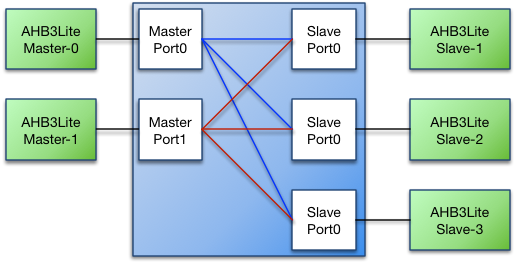
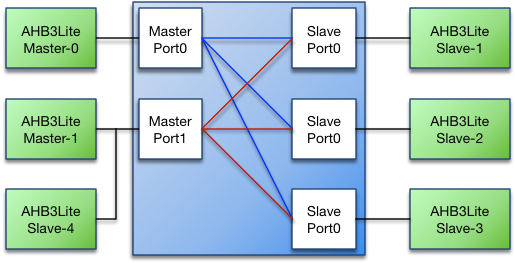
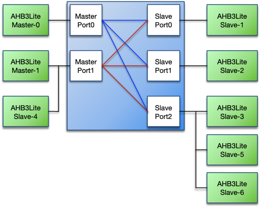
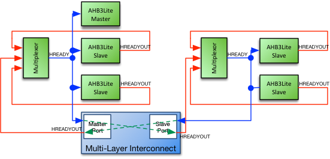
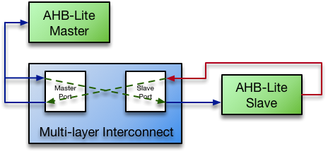

# AHB-Lite Multi-Layer Switch Datasheet

## Contents

-   [Introduction](#introduction)
-   [Specifications](#specifications)
-   [Configurations](#configurations)
-   [Interfaces](#interfaces)
-   [Resources](#resources)
-   [Revision History](#revision-history)

## Introduction

The Roa Logic AHB-Lite Multi-layer Interconnect is a fully parameterized soft IP High Performance, Low Latency Interconnect Fabric for AHB-Lite. It allows a virtually unlimited number of AHB-Lite Bus Masters and Slaves to be connected without the need of bus arbitration to be implemented by the Bus Masters. Instead, Slave Side Arbitration is implemented for each Slave Port within the core.

The Multi-layer Interconnect supports priority based and Round-Robin based arbitration when multiple Bus Masters request access to the same Slave Port. Typically arbitration completes within 1 clock cycle.

### Features

-   AMBA AHB-Lite Compatible

-   Fully parameterized

-   Unlimited number of Bus Masters and Slaves[1]

-   Slave side arbitration

-   Priority and Round-Robin based arbitration

-   Slave Port address decoding

## Specifications

### Functional Description

The Roa Logic AHB-Lite Multi-layer Interconnect is a highly configurable Interconnect Fabric for AMBA AHB-Lite based systems, enabling multiple Masters to be connected to multiple Slaves.

Connections are dynamically created based on which Slave a Master is addressing, and once created enable direct communication between Master and Slave without other Masters being aware or interfering.

A new connection is typically created within one clock cycle, providing high bandwidth and low latency communication between Master and Slave.

### Master Port

An AHB-Lite Bus Master connects to a Master port of the Multi-layer Interconnect. The Master port is implemented as a regular AHB-Lite Slave Interface thereby allowing support for complex bus structures.

The following figure shows an example bus structure where a Bus Master – Master-1 – has two directly connected Slaves; the Interconnect-Master-Port1 and Slave-4

To access a Slave, the Interconnect first checks if the designated Slave Port is available. If it is available the Slave Port immediately switches to the requesting Master. If the Slave Port is occupied due to another Master accessing the Slave, the Master Port generates wait states until the requested Slave becomes available. Note the pipelined nature of the AHB-Lite bus may cause a single wait state to be inserted when the Slave switches to a new Master.

The Slave Port always retains the connection to the Master until another Master requests access to that Slave Port; this enables the original Master to request further access to the Slave without incurring any delay due to arbitration.

#### Master Priority

Each Master Port has a 3-bit priority level port (`mst_priority[2:0]`).

When multiple Masters with different priority levels request access to the same Slave Port, access is always granted to the Master with the highest priority level. If a new Master requests access while a transaction is already in progress, access will be granted according to its priority, ahead of any waiting lower priority Masters. If Masters have the same priority level, then access is granted based on a Round-Robin scheme.

Master priority may be set dynamically, however assigning a static priority results in a smaller Interconnect and reduces timing paths. The priority value may only be changed while the Master Port is idle; i.e. `mst_HSEL` is negated (‘0’) and/or when `mst_HTRANS` is IDLE.

#### Bus Locking Support

The priority levels determine the order in which Masters are granted access to the Slave Port. The Slave Port switches between masters when the current accessing master is idle (`mst_HSEL` is negated and/or `mst_HTRANS` = IDLE) or when the current burst completes.

However the current Master may lock the bus by asserting `HMASTLOCK`; this prevents the Slave port switching.

#### Specifying the number of Master Ports

The number of Master Ports is specified by the `MASTERS` parameter.

### Slave Port

An AHB-Lite Bus Slave connects to a Slave Port of the Multi-layer Interconnect. The Slave Port is implemented as a regular AHB3-ite Master Interface thereby allowing support for complex bus structures such as shown below:

#### Address Space Configuration

Each Slave Port has an Address Base (`slv_addr_base`) and Address Mask (`slv_addr_mask`) port. Together these set the address range covered by the Slave Port.

The Address Base port specifies the base address for the address range covered by the Slave Port and the Address Mask port defines the address range covered by the Slave Port. The internal port select signal is specified as `slv_addr_base` AND `slv_addr_mask`.

The Address Base and Address Mask values may be changed dynamically, however assigning static values results in a smaller Interconnect and reduces timing paths. Address Base and Address Mask may only be changed when the slave port(s) are idle. Since multiple masters may be active at the same time trying to access the Interconnect, special care must be taken to ensure NO master accesses the Interconnect while updating the Address Base and Address Mask values.

The Slave Port asserts `HSEL` when accesses are within the port’s address range. When the port is not being accessed `HSEL` is negated (‘0’), but `HTRANS` and other AMBA signals will still provide data. These signals must be ignored while `HSEL` is negated (‘0’).

The slave port will output the full address, i.e. all `HADDR_SIZE` bits, on its address bus (`slv_HADDR`). Connected AMBA slaves should use the relevant least significant bits (LSBs) only.

##### Example 1

    slave\_addr\_base = 32'h1000\_0000
    slave\_addr\_mask = 32'hF000\_0000
    Address-range = 32'h1000\_0000 to 32'h1FFF\_FFFF

##### Example 2

    slave\_addr\_base = 32'h4000\_0000
    slave\_addr\_mask = 32'hE000\_0000
    Address-range = 32'h4000\_0000 to 32'h5FFF\_FFFF

#### Slave Port HREADYOUT and HREADY Routing

The Slave Port has an `HREADYOUT` port, which is not part of the AHB-Lite specification. It is required to support slaves on the master’s local bus. The `HREADY` signal, generated by the multiplexor, is driven to the addressed slave’s `HREADYOUT` port.

The simple case of where only one master is connected to a Master Port or where only a single slave is connected to a Slave Port is illustrated below.

There are no multiplexors on either the Master Bus or the Slave Bus. Since there is no other slave on the Master Bus, its `HREADY` signal is only driven by the Master Port’s `HREADYOUT` signal. Thus the Master Port’s `HREADYOUT` drives both the Master’s `HREADY` input and the Master Port’s `HREADY` input.

Similarly since there is no other slave on the Slave Bus, the Slave Port’s `HREADYOUT` signals drives the slave’s `HREADY` input and the slave’s `HREADYOUT` signal drives the Slave Port’s `HREADY` input.

#### Specifying the number of Slave Ports

The number of Slave Ports is specified by the `SLAVES` parameter.

## Configurations

### Introduction

The Roa Logic AHB-Lite Multi-layer Interconnect is a highly configurable Interconnect Fabric for AMBA AHB-Lite based systems. The core parameters and configuration options are described in this section.

### Core Parameters

| Parameter    |   Type  | Default | Description            |
|:-------------|:-------:|:-------:|:-----------------------|
| `HADDR_SIZE` | Integer |    32   | Address Bus Size       |
| `HDATA_SIZE` | Integer |    32   | Data Bus Size          |
| `MASTERS`    | Integer |    3    | Number of Master Ports |
| `SLAVES`     | Integer |    8    | Number of Slave Ports  |

#### HADDR\_SIZE

The `HADDR_SIZE` parameter specifies the width of the address bus for all Master and Slave ports.

#### HDATA\_SIZE

The `HDATA_SIZE` parameter specifies the width of the data bus for all Master and Slave ports.

#### MASTERS

The `MASTERS` parameter specifies the number of Master Ports on the Interconnect fabric.

#### SLAVES

The `SLAVES` parameter specifies the number of Slave Ports on the Interconnect Fabric.

## Interfaces

### Global Signals

The common signals are shared between all devices on the AHB bus. The AHB-Lite Interconnect has Master and Slave AHB-Lite buses and they all use the global signals.

| Port      | Size | Direction | Description                   |
|:----------|:----:|:---------:|:------------------------------|
| `HRESETn` |   1  |   Input   | Asynchronous active low reset |
| `HCLK`    |   1  |   Input   | System clock input            |

#### HRESETn

When the active low asynchronous `HRESETn` input is asserted (‘0’), the core is put into its initial reset state.

#### HCLK

`HCLK` is the system clock. All internal logic operates at the rising edge of the system clock. All AHB bus timings are related to the rising edge of `HCLK`. All Master and Slave ports must operate at the same `HCLK` clock.

### Master Interfaces

The Master Ports are regular AMB3-Lite slave interfaces. All signals are supported. See the AHB-Lite specifications for a complete description of the signals.

| Port            |     Size     | Direction | Description               |
|:----------------|:------------:|:---------:|:--------------------------|
| `mst_HSEL`      |       1      |   Input   | Bus Select                |
| `mst_HTRANS`    |       2      |   Input   | Transfer Type             |
| `mst_HADDR`     | `HADDR_SIZE` |   Input   | Address Bus               |
| `mst_HWDATA`    | `HDATA_SIZE` |   Input   | Write Data Bus            |
| `mst_HRDATA`    | `HDATA_SIZE` |   Output  | Read Data Bus             |
| `mst_HWRITE`    |       1      |   Input   | Write Select              |
| `mst_HSIZE`     |       3      |   Input   | Transfer Size             |
| `mst_HBURST`    |       3      |   Input   | Transfer Burst Size       |
| `mst_HPROT`     |       4      |   Input   | Transfer Protection Level |
| `mst_HMASTLOCK` |       1      |   Input   | Transfer Master Lock      |
| `mst_HREADYOUT` |       1      |   Output  | Transfer Ready Output     |
| `mst_HREADY`    |       1      |   Input   | Transfer Ready Input      |
| `mst_HRESP`     |       1      |   Input   | Transfer Response         |

#### mst\_HSEL

The Master Port only responds to other signals on its bus when `HSEL` is asserted (‘1’). When `mst_HSEL` is negated (‘0’) the Master Port considers the bus IDLE and negates `mst_HREADYOUT` (‘0’).

#### mst\_HTRANS

`mst_HTRANS` indicates the type of the current transfer. It is driven to the connected slave.

| HTRANS | Type   | Description                                                                              |
|:------:|:-------|:-----------------------------------------------------------------------------------------|
|   00   | IDLE   | No transfer required                                                                     |
|   01   | BUSY   | Connected master is not ready to accept data, but intents to continue the current burst. |
|   10   | NONSEQ | First transfer of a burst or a single transfer                                           |
|   11   | SEQ    | Remaining transfers of a burst                                                           |

#### mst\_HADDR

`mst_HADDR` is the address bus. Its size is determined by the `HADDR_SIZE` parameter. It is driven to the connected slave.

#### mst\_HWDATA

`mst_HWDATA` is the write data bus. Its size is determined by the `HDATA_SIZE` parameter. It is driven to the connected slave.

#### mst\_HRDATA

`mst_HRDATA` is the read data bus. Its size is determined by `HDATA_SIZE` parameter. The connected slave drives it.

#### mst\_HWRITE

`mst_HWRITE` is the read/write signal. `HWRITE` asserted (‘1’) indicates a write transfer. It is driven to the connected slave.

#### mst\_HSIZE

`mst_HSIZE` indicates the size of the current transfer. It is driven to the connected slave.

| HSIZE | Size    | Description |
|:-----:|:--------|:------------|
| `000` | 8bit    | Byte        |
| `001` | 16bit   | Half Word   |
| `010` | 32bit   | Word        |
| `011` | 64bits  | Double Word |
| `100` | 128bit  |             |
| `101` | 256bit  |             |
| `110` | 512bit  |             |
| `111` | 1024bit |             |

#### mst\_HBURST

The burst type indicates if the transfer is a single transfer or part of a burst. It is driven to the connected slave.

| HBURST | Type   | Description                  |
|:------:|:-------|:-----------------------------|
|  `000` | SINGLE | Single access                |
|  `001` | INCR   | Continuous incremental burst |
|  `010` | WRAP4  | 4-beat wrapping burst        |
|  `011` | INCR4  | 4-beat incrementing burst    |
|  `100` | WRAP8  | 8-beat wrapping burst        |
|  `101` | INCR8  | 8-beat incrementing burst    |
|  `110` | WRAP16 | 16-beat wrapping burst       |
|  `111` | INCR16 | 16-beat incrementing burst   |

#### mst\_HPROT

The protection signals provide information about the bus transfer. They are intended to implement some level of protection. It is driven to the connected slave.

| Bit \# | Value | Description                    |
|:------:|:-----:|:-------------------------------|
|    3   |   1   | Cacheable region addressed     |
|        |   0   | Non-cacheable region addressed |
|    2   |   1   | Bufferable                     |
|        |   0   | Non-bufferable                 |
|    1   |   1   | Privileged Access              |
|        |   0   | User Access                    |
|    0   |   1   | Data Access                    |
|        |   0   | Opcode fetch                   |

#### mst\_HREADYOUT

When a slave is addressed, the `mst_HREADYOUT` indicates that the addressed slave finished the current transfer. The Interconnect IP routes the addressed slave’s `HREADY` signal to the master.

When no slave is address, the `mst_HREADYOUT` signal is generated locally, inside the Interconnect.

#### mst\_HMASTLOCK

The master lock signal indicates if the current transfer is part of a locked sequence, commonly used for Read-Modify-Write cycles. While the `mst_HMASTLOCK` is asserted, the Interconnect IP cannot switch the addressed slave to another master, even if that master has a higher priority. Instead the current master retains access to slave until it releases `mst_HMASTLOCK`.

#### mst\_HREADY

`mst_HREADY` indicates the status of the local `HREADY` on the master’s local bus. It is routed to the `HREADYOUT` port of the addressed slave.

#### mst\_HRESP

`mst_HRESP` is the transfer response from the addressed slave, it can either be OKAY (‘0’) or ERROR (‘1’). The Interconnect IP routes the addressed slave’s `HRESP` port to `mst_HRESP`.

### Slave Interface

The Slave Ports are regular AHB-Lite master interfaces.. All signals are supported. In addition each Slave Port has a non-standard `slv_HREADYOUT`. See the AHB-Lite specifications for a complete description of the signals.

| Port            |     Size     | Direction | Description               |
|:----------------|:------------:|:---------:|:--------------------------|
| `slv_HSEL`      |       1      |   Output  | Bus Select                |
| `slv_HADDR`     | `HADDR_SIZE` |   Output  | Address                   |
| `slv_HWDATA`    | `HDATA_SIZE` |   Output  | Write Data Bus            |
| `slv_HRDATA`    | `HDATA_SIZE` |   Input   | Read Data Bus             |
| `slv_HWRITE`    |       1      |   Output  | Write Select              |
| `slv_HSIZE`     |       3      |   Output  | Transfer size             |
| `slv_HBURST`    |       3      |   Output  | Transfer Burst Size       |
| `slv_HPROT`     |       4      |   Output  | Transfer Protection Level |
| `slv_HTRANS`    |       2      |   Input   | Transfer Type             |
| `slv_HMASTLOCK` |       1      |   Output  | Transfer Master Lock      |
| `slv_HREADY`    |       1      |   Input   | Transfer Ready Input      |
| `slv_HRESP`     |       1      |   Input   | Transfer Response         |

#### slv\_HSEL

The Master Port only responds to other signals on its bus when `HSEL` is asserted (‘1’). When `slv_HSEL` is negated (‘0’) the Master Port considers the bus IDLE and negates `mst_HREADYOUT` (‘0’).

#### slv\_HADDR

`slv_HADDR` is the data address bus. Its size is determined by the `HADDR_SIZE` parameter. The connected master drives `slv_HADDR`.

#### slv \_HRDATA

`slv_HRDATA` is the read data bus. Its size is determined by the `HDATA_SIZE` parameter. It is driven to the connected master.

#### slv \_HWDATA

`slv_HWDATA` is the write data bus. Its size is determined by the `HDATA_SIZE` parameter. The connected master drives `slv_HADDR`.

#### slv \_HWRITE

`slv_HWRITE` is the read/write signal. `HWRITE` asserted (‘1’) indicates a write transfer. The connected master drives `slv_HWRITE`.

#### slv\_HSIZE

`slv_HSIZE` indicates the size of the current transfer. The connected master drives `slv_HSIZE`.

| HSIZE | Size    | Description |
|:-----:|:--------|:------------|
| `000` | 8bit    | Byte        |
| `001` | 16bit   | Half Word   |
| `010` | 32bit   | Word        |
| `011` | 64bits  | Double Word |
| `100` | 128bit  |             |
| `101` | 256bit  |             |
| `110` | 512bit  |             |
| `111` | 1024bit |             |

#### slv\_HBURST

The burst type indicates if the transfer is a single transfer or part of a burst. The connected master drives it.

| HBURST | Type   | Description                  |
|:------:|:-------|:-----------------------------|
|  `000` | Single | Single access                |
|  `001` | INCR   | Continuous incremental burst |
|  `010` | WRAP4  | 4-beat wrapping burst        |
|  `011` | INCR4  | 4-beat incrementing burst    |
|  `100` | WRAP8  | 8-beat wrapping burst        |
|  `101` | INCR8  | 8-beat incrementing burst    |
|  `110` | WRAP16 | 16-beat wrapping burst       |
|  `111` | INCR16 | 16-beat incrementing burst   |

#### slv\_HPROT

The data protection signals provide information about the bus transfer. They are intended to implement some level of protection. The connected master drives `slv_HPROT`.

| Bit\# | Value | Description                                |
|:-----:|:-----:|:-------------------------------------------|
|   3   |   1   | Cacheable region addressed                 |
|       |   0   | Non-cacheable region addressed             |
|   2   |   1   | Bufferable                                 |
|       |   0   | Non-bufferable                             |
|   1   |   1   | Privileged access. CPU is not in User Mode |
|       |   0   | User access. CPU is in User Mode           |
|   0   |   1   | Data transfer, always ‘1’                  |

#### slv\_HTRANS

`slv_HTRANS` indicates the type of the current data transfer.

| slv\_HTRANS | Type   | Description                          |
|:-----------:|:-------|:-------------------------------------|
|     `00`    | IDLE   | No transfer required                 |
|     `01`    | BUSY   | *Not used*                           |
|     `10`    | NONSEQ | First transfer of an data burst      |
|     `11`    | SEQ    | Remaining transfers of an data burst |

#### slv\_HMASTLOCK

The master lock signal indicates if the current transfer is part of a locked sequence, commonly used for Read-Modify-Write cycles. The connected master drives `slv_MASTLOCK`.

#### slv\_HREADYOUT

| **Note:** |                                                  |
|:----------|:-------------------------------------------------|
|           | `slv_HREADYOUT` is not an AHB-Lite Master Signal |

The `slv_HREADYOUT` signal reflects the state of the connected Master Port’s `HREADY` port. It is provided to support local slaves connected directly to the Master’s AHB-Lite bus. It is driven by the connected master’s `HREADY` port.

#### slv\_HREADY

`slv_HREADY` indicates whether the addressed slave is ready to transfer data or not. When `slv_HREADY` is negated (‘0’) the slave is not ready, forcing wait states. When `slv_HREADY` is asserted (‘0’) the slave is ready and the transfer completed. It is driven to the connected master’s `HREADYOUT` port.

#### slv\_HRESP

`slv_HRESP` is the data transfer response, it can either be OKAY (‘0’) or ERROR (‘1’). It is driven to the connected master.

## Resources

Below are some example implementations for various platforms.

All implementations are push button, no effort has been undertaken to reduce area or improve performance.

| Platform | DFF | Logic Cells | Memory | Performance (MHz) |
|:---------|:---:|:-----------:|:------:|:-----------------:|
| lfxp3c-5 |  34 |     103     |    0   |       226MHz      |
|          |     |             |        |                   |
|          |     |             |        |                   |
|          |     |             |        |                   |

## Revision History

|   **Date**  | **Rev.** | **Comments**    |
|:-----------:|:--------:|:----------------|
| 13-Oct-2017 |    1.0   | Initial Release |
|             |          |                 |
|             |          |                 |
|             |          |                 |

[1] The number of Bus Masters and Slaves is physically limited by the timing requirements.
