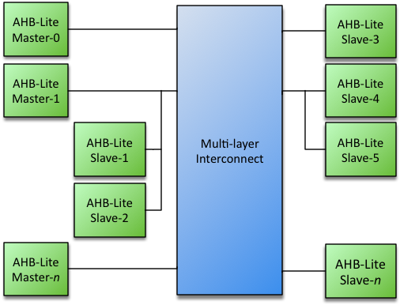

# AHB-Lite Multilayer Switch

The Roa Logic AHB-Lite Multi-layer Interconnect is a fully parameterized High Performance, Low Latency Interconnect Fabric soft IP for AHB-Lite. It allows a virtually unlimited number of AHB-Lite Bus Masters and Slaves to be connected without the need of bus arbitration to be implemented by the Bus Masters. Instead, Slave Side Arbitration is implemented for each Slave Port within the core.

The Multi-layer Interconnect supports Priority and Round-Robin based arbitration when multiple Bus Masters request access to the same Slave Port. Typically arbitration completes within 1 clock cycle

## Documentation

- [Datasheet](DATASHEET.md)
  - [PDF Format](docs/ahb3lite_interconnect_datasheet.pdf)

## Features

- AMBA AHB-Lite Compatible
- Fully parameterized
- Unlimited number of Bus Masters and Slaves[[1\]](https://roalogic.com/portfolio/ahb-lite-multilayer-switch/#_ftn1)
- Slave side arbitration
- Priority and Round-Robin based arbitration
- Slave Port address decoding

## Interfaces

- AHB-Lite Master & Slave Interfaces

## License

Released under the RoaLogic [Non-Commerical License](/LICENSE.md)

## Dependencies

This release requires the ahb3lite package found here https://github.com/RoaLogic/ahb3lite_pkg
