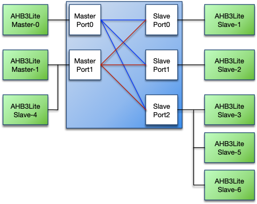

# Datasheet: {{site.title}}

 [Download PDF Datasheet](./{{site.github.repository_name | append: "_datasheet.pdf"}})
{: .download-pdf}

## Contents

-   [Introduction](#introduction)
    -   [Features](#features)
-   [Specifications](#specifications)
    -   [Functional Description](#functional-description)
    -   [Master Port](#master-port)
    -   [Slave Port](#slave-port)
-   [Configuration](#configuration)
    -   [Introduction](#introduction-1)
    -   [Core Parameters](#core-parameters)
    -   [Core Macros](#core-macros)
-   [Interfaces](#interfaces)
    -   [Global Signals](#global-signals)
    -   [Master Interface](#master-interface)
    -   [Slave Interface](#slave-interface)
-   [Resources](#resources)
-   [Revision History](#revision-history)

## Introduction

The Roa Logic *AHB-Lite Multi-layer Interconnect Switch*, hereafter
referred to as ’the Interconnect’, is a fully parameterized high
performance, low latency interconnect fabric soft IP for AHB-Lite. It
allows a virtually unlimited number of AHB-Lite bus masters and slaves
to be connected without the need for bus arbitration to be implemented
by the bus masters. Instead, slave side arbitration is implemented for
each slave port within the core.

<figure>
<figcaption aria-hidden="true">Figure 1: Multi–layer Interconnect Usage Example</figcaption>
</figure>

The Interconnect supports priority based and round-robin based
arbitration when multiple bus masters request access to the same slave
port. Typically arbitration completes within 1 clock cycle.

### Features

-   AMBA AHB-Lite compatible

-   Fully parameterized

-   Unlimited number of bus masters and slaves[^1]

-   Slave side arbitration

-   Priority and round-robin based arbitration

-   Slave port address decoding

-   Slave masking to increase system performance - New in v1.2

-   Error assertion when no slave correctly addressed - New in v1.3

## Specifications

### Functional Description

The Roa Logic AHB-Lite Multi-layer Interconnect is a highly configurable
interconnect fabric for AMBA AHB-Lite based systems, enabling multiple
masters to be connected to multiple slaves.

Connections are dynamically created based on which slave a master is
addressing, and once created enable direct communication between master
and slave without other masters being aware or interfering.

A new connection is typically created within one clock cycle, providing
high bandwidth and low latency communication between master and slave.

<figure>
<figcaption aria-hidden="true">Figure 2: Example Master / Slave Communication Setup</figcaption>
</figure>

### Master Port

An AHB-Lite bus master connects to a master port of the Multi-layer
Interconnect. The master port is implemented as a regular AHB-Lite slave
interface thereby allowing support for complex bus structures.

The following figure shows an example bus structure where a bus master –
Master-1 – has two directly connected slaves; the
Interconnect-Master-Port1 and Slave-4

<figure>
<figcaption aria-hidden="true">Figure 3: Connectivity Example for 2 Bus Masters, 4 Slaves</figcaption>
</figure>

To access a slave, the Interconnect first checks if the designated slave
port is available. If it is available the slave port immediately
switches to the requesting master. If the slave port is occupied due to
another master accessing the slave, the master port generates wait
states until the requested slave becomes available. Note the pipelined
nature of the AHB-Lite bus may cause a single wait state to be inserted
when the slave switches to a new master.

The slave port always retains the connection to the master until another
master requests access to that slave port; this enables the original
master to request further access to the slave without incurring any
delay due to arbitration.

#### Master Priority

Each master port has a priority level port (`mst_priority[ ]`).

When multiple masters with different priority levels request access to
the same slave port, access is always granted to the master with the
highest priority level. If a new master requests access while a
transaction is already in progress, access will be granted according to
its priority, ahead of any waiting lower priority masters. If masters
have the same priority level, then access is granted based on a
round-robin scheme.

Master priority may be set dynamically, however assigning a static
priority results in a smaller Interconnect and reduces timing paths. The
priority value may only be changed while the master port is idle; i.e.
`mst_HSEL` is negated (‘0’) and/or when `mst_HTRANS` is IDLE.

#### Bus Locking Support

The priority levels determine the order in which masters are granted
access to the slave port. The slave port switches between masters when
the current accessing master is idle (`mst_HSEL` is negated and/or
`mst_HTRANS` = IDLE) or when the current burst completes.

However the current master may lock the bus by asserting `HMASTLOCK`;
this prevents the slave port switching.

#### Specifying the number of Master Ports

The number of master ports is specified by the `MASTERS` parameter.

### Slave Port

An AHB-Lite bus slave connects to a slave port of the Multi-layer
Interconnect. The slave port is implemented as a regular AHB3-Lite
master interface thereby allowing support for complex bus structures
such as shown below:

<figure>
<figcaption aria-hidden="true">Figure 4: Connectivity Example for 2 Bus Masters, 6 Slaves</figcaption>
</figure>

#### Address Space Configuration

Each slave port has an address base (`slv_addr_base`) and address mask
(`slv_addr_mask`) port. Together these set the address range covered by
the slave port.

The address base port specifies the base address for the address range
covered by the slave port and the address mask port defines the address
range covered by the slave port. The internal port select signal is
specified as `slv_addr_base` AND `slv_addr_mask`.

The address base and address mask values may be changed dynamically,
however assigning static values results in a smaller Interconnect and
reduces timing paths. Address base and address mask may only be changed
when the slave port(s) are idle. Since multiple masters may be active at
the same time trying to access the interconnect, special care must be
taken to ensure no master accesses the Interconnect while updating the
address base and address mask values.

The slave port asserts `HSEL` when accesses are within the port’s
address range. When the port is not being accessed `HSEL` is negated
(‘0’), but `HTRANS` and other AMBA signals will still provide data.
These signals must be ignored while `HSEL` is negated (‘0’).

The slave port will output the full address, i.e. all `HADDR_SIZE` bits,
on its address bus (`slv_HADDR`). Connected AMBA slaves should use the
relevant least significant bits (LSBs) only.

##### Example 1

    slave_addr_base = 32'h1000_0000
    slave_addr_mask = 32'hF000_0000
    Address-range = 32'h1000_0000 to 32'h1FFF_FFFF

##### Example 2

    slave_addr_base = 32'h4000_0000
    slave_addr_mask = 32'hE000_0000
    Address-range = 32'h4000_0000 to 32'h5FFF_FFFF

#### Slave Port HREADYOUT and HREADY Routing

The slave port has an `HREADYOUT` port, which is not part of the
AHB-Lite specification. It is required to support slaves on the master’s
local bus. The `HREADY` signal, generated by the multiplexor on the
master local bus, drives the addressed slave’s `HREADYOUT` port.

<figure>
<figcaption aria-hidden="true">Figure 5: HREADYOUT and HREADY Routing</figcaption>
</figure>

The simple case of where only one master is connected to a master port
or where only a single slave is connected to a slave port is illustrated
below.

There are no multiplexors on either the master bus or the slave bus.
Since there is no other slave on the master bus, its `HREADY` signal is
only driven by the master port’s `HREADYOUT` signal. Thus the master
port’s `HREADYOUT` drives both the master’s `HREADY` input and the
master port’s `HREADY` input.

Similarly since there is no other slave on the slave bus, the slave
port’s `HREADYOUT` signals drives the slave’s `HREADY` input and the
slave’s `HREADYOUT` signal drives the slave port’s `HREADY` input.

<figure>
<figcaption aria-hidden="true">Figure 6: Single Master/Slave Routing</figcaption>
</figure>

#### Specifying the number of Slave Ports

The number of slave ports is specified by the `SLAVES` parameter.

## Configuration

### Introduction

The Roa Logic AHB-Lite Multi-layer Interconnect is a highly configurable
interconnect fabric for AMBA AHB-Lite based systems. The core parameters
and configuration options are described in this section.

### Core Parameters

| Parameter                      |  Type   |      Default      | Description                                                                                    |
|:-------------------------------|:-------:|:-----------------:|:-----------------------------------------------------------------------------------------------|
| `HADDR_SIZE`                   | Integer |        32         | Address bus size                                                                               |
| `HDATA_SIZE`                   | Integer |        32         | Data bus size                                                                                  |
| `MASTERS`                      | Integer |         3         | Number of master ports                                                                         |
| `SLAVES`                       | Integer |         8         | Number of slave ports                                                                          |
| `SLAVE_MASK[MASTERS]`          |  Array  |     All ’1’s      | Mask slaves accessible by each master                                                          |
| `ERROR_ON_SLAVE_MASK[MASTERS]` |  Array  | inv(`SLAVE_MASK`) | Enable error reporting for masked slaves                                                       |
| `ERROR_ON_NO_SLAVE[MASTERS]`   |  Array  |     All ’0’s      | Disable error reporting when non-mapped address space accessed (to match previous IP releases) |
|                                |         |                   |                                                                                                |

<strong>Table 1: Core Parameters</strong>

#### HADDR_SIZE

The `HADDR_SIZE` parameter specifies the width of the address bus for
all master and slave ports.

#### HDATA_SIZE

The `HDATA_SIZE` parameter specifies the width of the data bus for all
master and slave ports.

#### MASTERS

The `MASTERS` parameter specifies the number of master ports on the
interconnect fabric.

#### SLAVES

The `SLAVES` parameter specifies the number of slave ports on the
interconnect fabric.

#### SLAVE_MASK\[ \]

The `SLAVE_MASK[ ]` parameter determines if a master may access a slave.
Defining which master may access individual slaves (rather than allowing
all masters to access all slaves) may significantly reduce the logic
area of the interconnect and improve overall performance.

There is one `SLAVE_MASK` parameter per master, each `SLAVES` bits wide.
i.e. `SLAVE_MASK[ ]` is an array of dimensions `MASTERS` x `SLAVES`.

Setting a `SLAVE_MASK[ ]` bit to ’0’ indicates that master cannot access
the slave. Conversely, setting a `SLAVE_MASK[ ]` bit to ’1’ indicates
that master may access the slave.

#### ERROR_ON_SLAVE_MASK\[ \]

The `ERROR_ON_SLAVE_MASK[ ]` parameter enables generating an AHB error
response when the master attempts to access a masked slave port.

There is one `ERROR_ON_SLAVE_MASK` parameter per master, each `SLAVES`
bits wide. i.e. `ERROR_ON_SLAVE_MASK[ ]` is an array of dimensions
`MASTERS` x `SLAVES`.

Setting an `ERROR_ON_SLAVE_MASK[ ]` bit to ’0’ indicates that an AHB
error response will not be generated if the master is masked from
accessing the corresponding slave. Conversely, setting a
`ERROR_ON_SLAVE_MASK[ ]` bit to ’1’ indicates that an AHB error response
will be generated if the master is masked from accessing the
corresponding slave.

The default value of `ERROR_ON_SLAVE_MASK[ ]` is the bitwise inverse of
`SLAVE_MASK[ ]` - i.e. inv(`SLAVE_MASK[ ]`). If `SLAVE_MASK[ ]` is
assigned a value, then `ERROR_ON_SLAVE_MASK[ ]` is by default
inv(`SLAVE_MASK[ ]`). The default value of inv(`SLAVE_MASK[ ]`) causes
the core to generate an error response when a masked slave is addressed
by a master.

#### ERROR_ON_NO_SLAVE\[ \]

The AHB-Lite Multi-layer Interconnect uses `slv_addr_base` and
`slv_addr_mask` to decode the target slave port. It can therefore
determine if a master attempts to access a non-mapped slave port. This
means the switch can generate an AHB error response should a master
attempt to access an address which is not mapped to any slave port.

The `ERROR_ON_NO_SLAVE[ ]` is a is `MASTERS` bits wide parameter used to
enable error response generation for this scenario. Setting a bit of the
parameter to ’1’ enables error generation for the corresponding master.

The default value for `ERROR_ON_NO_SLAVE[ ]` is all bits set to ’0’,
disabling this feature to match the behaviour of previous releases of
the IP.

### Core Macros

| Macro                           | Description                       |
|:--------------------------------|:----------------------------------|
| `RECURSIVE_FUNCTIONS_SUPPORTED` | Enable use of recursive functions |
|                                 |                                   |

<strong>Table 2: Core Macros</strong>

#### RECURSIVE_FUNCTIONS_SUPPORTED

Recursive functions and modules are used within the verilog source code.
However EDA tools vary in their support for recursion, with some
supporting recursive functions, whereas others support recursive modules
or both. For example, Intel Quartus v19.1 and earlier supports recursive
modules, but not recursive functions.

To accomodate these toolchain differences, recursive modules are the
default method used for implementation. However recursive functions may
instead be enabled by setting the synthesis macro
`RECURSIVE_FUNCTIONS_SUPPORTED`

## Interfaces

### Global Signals

The common signals are shared between all devices on the AHB bus. The
AHB-Lite Interconnect has master and slave AHB-Lite buses and they all
use the global signals.

| Port      | Size | Direction | Description                   |
|:----------|:----:|:---------:|:------------------------------|
| `HRESETn` |  1   |   Input   | Asynchronous active low reset |
| `HCLK`    |  1   |   Input   | System clock input            |
|           |      |           |                               |

<strong>Table 3: AMBA3 Global Signals</strong>

#### HRESETn

When the active low asynchronous `HRESETn` input is asserted (‘0’), the
core is put into its initial reset state.

#### HCLK

`HCLK` is the system clock. All internal logic operates at the rising
edge of the system clock. All AHB bus timings are related to the rising
edge of `HCLK`. All master and slave ports must operate at the same
`HCLK` clock.

### Master Interface

The master ports are regular AHB3-Lite slave interfaces. All signals are
supported. See the AHB-Lite specifications for a complete description of
the signals. In addition, a custom master priority port is included per
interface to enable prioritisation when multiple masters attempt to
simultaneously access the same slave. This prioritisation may be defined
statically or dynamically changed during operation.

The AHB-Lite Multi-layer Interconnect implements 1 or more interfaces to
AHB-Lite masters as defined by the `MASTERS` parameter. Therefore the
following signals are all arrays reflecting the number of masters
supported.

| Port            |     Size     | Direction | Description               |
|:----------------|:------------:|:---------:|:--------------------------|
| `mst_HSEL`      |      1       |   Input   | Bus select                |
| `mst_HTRANS`    |      2       |   Input   | Transfer type             |
| `mst_HADDR`     | `HADDR_SIZE` |   Input   | Address bus               |
| `mst_HWDATA`    | `HDATA_SIZE` |   Input   | Write data bus            |
| `mst_HRDATA`    | `HDATA_SIZE` |  Output   | Read data bus             |
| `mst_HWRITE`    |      1       |   Input   | Write select              |
| `mst_HSIZE`     |      3       |   Input   | Transfer size             |
| `mst_HBURST`    |      3       |   Input   | Transfer burst size       |
| `mst_HPROT`     |      4       |   Input   | Transfer protection level |
| `mst_HMASTLOCK` |      1       |   Input   | Transfer master lock      |
| `mst_HREADYOUT` |      1       |  Output   | Transfer ready output     |
| `mst_HREADY`    |      1       |   Input   | Transfer ready input      |
| `mst_HRESP`     |      1       |   Input   | Transfer response         |
|                 |              |           |                           |

<strong>Table 4: Master Interface AHB-Lite Port</strong>

| Port           |            Size             | Direction | Description            |
|:---------------|:---------------------------:|:---------:|:-----------------------|
| `mst_priority` | clog2(`MASTERS`) |   Input   | master priority Levels |
|                |                             |           |                        |

<strong>Table 5: Master Interface Custom Port</strong>

**Note:** clog2() refers to the System Verilog function by
the same name, defined below, and is used to determine the required
bitwidth of a bus required to represent the defined range of values:

> *The system function $clog2 shall return the ceiling of the log base 2
> of the argument (the log rounded up to an integer value). The argument
> can be an integer or an arbitrary sized vector value. The argument
> shall be treated as an unsigned value, and an argument value of 0
> shall produce a result of 0.*

#### mst_HSEL

The master port only responds to other signals on its bus when
`mst_HSEL` is asserted (‘1’). When `mst_HSEL` is negated (‘0’) the
master port considers the bus IDLE and asserts `HREADYOUT` (‘1’).

#### mst_HTRANS

`mst_HTRANS` indicates the type of the current transfer. It is driven to
the connected slave.

| HTRANS | Type   | Description                                                                              |
|:------:|:-------|:-----------------------------------------------------------------------------------------|
|   00   | IDLE   | No transfer required                                                                     |
|   01   | BUSY   | Connected master is not ready to accept data, but intents to continue the current burst. |
|   10   | NONSEQ | First transfer of a burst or a single transfer                                           |
|   11   | SEQ    | Remaining transfers of a burst                                                           |
|        |        |                                                                                          |

<strong>Table 6: Transfer Type (HTRANS)</strong>

#### mst_HADDR

`mst_HADDR` is the address bus. Its size is determined by the
`HADDR_SIZE` parameter. It is driven to the connected slave.

#### mst_HWDATA

`mst_HWDATA` is the write data bus. Its size is determined by the
`HDATA_SIZE` parameter. It is driven to the connected slave.

#### mst_HRDATA

`mst_HRDATA` is the read data bus. Its size is determined by
`HDATA_SIZE` parameter. The connected slave drives it.

#### mst_HWRITE

`mst_HWRITE` is the read/write signal. `mst_HWRITE` asserted (‘1’)
indicates a write transfer. It is driven to the connected slave.

#### mst_HSIZE

`mst_HSIZE` indicates the size of the current transfer. It is driven to
the connected slave.

| HSIZE |  Size   | Description |
|:-----:|:-------:|:------------|
| `000` |  8bit   | Byte        |
| `001` |  16bit  | Half word   |
| `010` |  32bit  | Word        |
| `011` | 64bits  | Double word |
| `100` | 128bit  |             |
| `101` | 256bit  |             |
| `110` | 512bit  |             |
| `111` | 1024bit |             |
|       |         |             |

<strong>Table 7: Transfer Size Values (HSIZE)</strong>

#### mst_HBURST

The burst type indicates if the transfer is a single transfer or part of
a burst. It is driven to the connected slave.

| HBURST |  Type  | Description                  |
|:------:|:------:|:-----------------------------|
| `000`  | SINGLE | Single access                |
| `001`  |  INCR  | Continuous incremental burst |
| `010`  | WRAP4  | 4-beat wrapping burst        |
| `011`  | INCR4  | 4-beat incrementing burst    |
| `100`  | WRAP8  | 8-beat wrapping burst        |
| `101`  | INCR8  | 8-beat incrementing burst    |
| `110`  | WRAP16 | 16-beat wrapping burst       |
| `111`  | INCR16 | 16-beat incrementing burst   |
|        |        |                              |

<strong>Table 8: Burst Types (HBURST)</strong>

#### mst_HPROT

The protection signals provide information about the bus transfer. They
are intended to implement some level of protection. It is driven to the
connected slave.

| Bit \# | Value | Description                    |
|:------:|:-----:|:-------------------------------|
|   3    |   1   | Cacheable region addressed     |
|        |   0   | Non-cacheable region addressed |
|   2    |   1   | Bufferable                     |
|        |   0   | Non-bufferable                 |
|   1    |   1   | Privileged access              |
|        |   0   | User access                    |
|   0    |   1   | Data access                    |
|        |   0   | Opcode fetch                   |
|        |       |                                |

<strong>Table 9: Protection Signals (HPROT)</strong>

#### mst_HREADYOUT

When a slave is addressed, the `mst_HREADYOUT` indicates that the
addressed slave finished the current transfer. The Interconnect IP
routes the addressed slave’s `HREADY` signal to the master.

When no slave is addressed, the `mst_HREADYOUT` signal is generated
locally, inside the Interconnect.

#### mst_HMASTLOCK

The master lock signal indicates if the current transfer is part of a
locked sequence, commonly used for Read-Modify-Write cycles. While the
`mst_HMASTLOCK` is asserted, the Interconnect IP cannot switch the
addressed slave to another master, even if that master has a higher
priority. Instead the current master retains access to slave until it
releases `mst_HMASTLOCK`.

#### mst_HREADY

`mst_HREADY` indicates the status of the local `HREADY` on the master’s
local bus. It is routed to the `HREADYOUT` port of the connected slave.

#### mst_HRESP

`mst_HRESP` is the transfer response from the connected slave, it can
either be OKAY (‘0’) or ERROR (‘1’). The Interconnect IP routes the
connected slave’s `HRESP` port to `mst_HRESP`.

#### mst_priority

`mst_priority` is a custom port per master interface and defines the
priority of the attached master. The width of the bus is calculated as
clog2(`MASTERS`), with the lowest priority value defined as 0
and the highest priority being `MASTERS-1`.

For example, for a system with 4 masters the width of `mst_priority`
will be 2 bits to enable each master to have a unique prioritisation
level, with lowest priority being 0 and highest priority being 3.

### Slave Interface

The slave ports are regular AHB-Lite master interfaces.. All signals are
supported. In addition each slave port has a non-standard
`slv_HREADYOUT`. See the AHB-Lite specifications for a complete
description of the signals.

The AHB-Lite Multi-layer Interconnect implements 1 or more interfaces to
AHB-Lite slaves as defined by the `SLAVES` parameter. Therefore the
following signals are all arrays reflecting the number of slaves
supported.

| Port            |     Size     | Direction | Description              |
|:----------------|:------------:|:---------:|:-------------------------|
| `slv_addr_base` | `HADDR_SIZE` |   Input   | Slave base address       |
| `slv_addr_mask` | `HADDR_SIZE` |   Input   | Slave address space mask |
|                 |              |           |                          |

<strong>Table 10: Slave Interface Customisation Port</strong>

| Port            |     Size     | Direction | Description               |
|:----------------|:------------:|:---------:|:--------------------------|
| `slv_HSEL`      |      1       |  Output   | Bus select                |
| `slv_HADDR`     | `HADDR_SIZE` |  Output   | Address                   |
| `slv_HWDATA`    | `HDATA_SIZE` |  Output   | Write data bus            |
| `slv_HRDATA`    | `HDATA_SIZE` |   Input   | Read data bus             |
| `slv_HWRITE`    |      1       |  Output   | Write select              |
| `slv_HSIZE`     |      3       |  Output   | Transfer size             |
| `slv_HBURST`    |      3       |  Output   | Transfer burst size       |
| `slv_HPROT`     |      4       |  Output   | Transfer protection level |
| `slv_HTRANS`    |      2       |   Input   | Transfer type             |
| `slv_HMASTLOCK` |      1       |  Output   | Transfer master lock      |
| `slv_HREADY`    |      1       |   Input   | Transfer ready input      |
| `slv_HRESP`     |      1       |   Input   | Transfer response         |
|                 |              |           |                           |

<strong>Table 11: Slave Interface AHB-Lite Port</strong>

#### slv_addr_base

`slv_addr_base` is a `SLAVES` sized array of addresses, each
`HADDR_SIZE` bits wide, defining the base address of each attached slave
device.

#### slv_addr_mask

`slv_addr_mask` is a `SLAVES` sized array of `HADDR_SIZE` bit wide
signals. Each `slv_addr_base` address is masked with the corresponding
`slv_addr_mask` value to define the addressable memory space of the
attached slave. Setting a bit of `slv_addr_mask` to ’0’ enables the
corresponding address bit.

See section ’Address Space Configuration’ for specific examples.

#### slv_HSEL

Slaves connected to the slave port must only respond to other signals on
the bus when `slv_HSEL` is asserted (‘1’). When `slv_HSEL` is negated
(‘0’) the interface is idle and the connected slaves must assert their
`HREADYOUT` (‘1’).

#### slv_HADDR

`slv_HADDR` is the data address bus. Its size is determined by the
`HADDR_SIZE` parameter. The connected master drives `slv_HADDR`.

#### slv_HRDATA

`slv_HRDATA` is the read data bus. Its size is determined by the
`HDATA_SIZE` parameter. It is driven to the connected master.

#### slv_HWDATA

`slv_HWDATA` is the write data bus. Its size is determined by the
`HDATA_SIZE` parameter. The connected master drives `slv_HADDR`.

#### slv_HWRITE

`slv_HWRITE` is the read/write signal. `slv_HWRITE` asserted (‘1’)
indicates a write transfer. The connected master drives `slv_HWRITE`.

#### slv_HSIZE

`slv_HSIZE` indicates the size of the current transfer. The connected
master drives `slv_HSIZE`.

| HSIZE |  Size   | Description |
|:-----:|:-------:|:------------|
| `000` |  8bit   | Byte        |
| `001` |  16bit  | Half word   |
| `010` |  32bit  | Word        |
| `011` | 64bits  | Double word |
| `100` | 128bit  |             |
| `101` | 256bit  |             |
| `110` | 512bit  |             |
| `111` | 1024bit |             |
|       |         |             |

<strong>Table 12: Data Transfer Sizes</strong>

#### slv_HBURST

The burst type indicates if the transfer is a single transfer or part of
a burst. The connected master drives it.

| HBURST |  Type  | Description                  |
|:------:|:------:|:-----------------------------|
| `000`  | Single | Single access                |
| `001`  |  INCR  | Continuous incremental burst |
| `010`  | WRAP4  | 4-beat wrapping burst        |
| `011`  | INCR4  | 4-beat incrementing burst    |
| `100`  | WRAP8  | 8-beat wrapping burst        |
| `101`  | INCR8  | 8-beat incrementing burst    |
| `110`  | WRAP16 | 16-beat wrapping burst       |
| `111`  | INCR16 | 16-beat incrementing burst   |
|        |        |                              |

<strong>Table 13: Burst Types (HBURST)</strong>

#### slv_HPROT

The data protection signals provide information about the bus transfer.
They are intended to implement some level of protection. The connected
master drives `slv_HPROT`.

| Bit\# | Value | Description                                |
|:-----:|:-----:|:-------------------------------------------|
|   3   |   1   | Cacheable region addressed                 |
|       |   0   | Non-cacheable region addressed             |
|   2   |   1   | Bufferable                                 |
|       |   0   | Non-bufferable                             |
|   1   |   1   | Privileged access. CPU is not in User Mode |
|       |   0   | User access. CPU is in User Mode           |
|   0   |   1   | Data transfer, always ‘1’                  |
|       |       |                                            |

<strong>Table 14: Data Protection Signals</strong>

#### slv_HTRANS

`slv_HTRANS` indicates the type of the current data transfer.

| slv_HTRANS |  Type  | Description                          |
|:----------:|:------:|:-------------------------------------|
|    `00`    |  IDLE  | No transfer required                 |
|    `01`    |  BUSY  | *Not used*                           |
|    `10`    | NONSEQ | First transfer of an data burst      |
|    `11`    |  SEQ   | Remaining transfers of an data burst |
|            |        |                                      |

<strong>Table 15: Data Transfer Type</strong>

#### slv_HMASTLOCK

The master lock signal indicates if the current transfer is part of a
locked sequence, commonly used for Read-Modify-Write cycles. The
connected master drives `slv_MASTLOCK`.

#### slv_HREADYOUT

The `slv_HREADYOUT` signal reflects the state of the connected master
port’s `HREADY` port. It is provided to support local slaves connected
directly to the master’s AHB-Lite bus. It is driven by the connected
master’s `HREADY` port.

**Note:** `slv_HREADYOUT` is not an AHB-Lite Signal.

#### slv_HREADY

`slv_HREADY` indicates whether the addressed slave is ready to transfer
data or not. When `slv_HREADY` is negated (‘0’) the slave is not ready,
forcing wait states. When `slv_HREADY` is asserted (‘0’) the slave is
ready and the transfer completed. It is driven to the connected master’s
`HREADYOUT` port.

#### slv_HRESP

`slv_HRESP` is the data transfer response, it can either be OKAY (‘0’)
or ERROR (‘1’). It is driven to the connected master.

## Resources

Below are some example implementations when targeting the Altera
Cyclone-V family of FPGAs. All implementations are push button, no
effort has been undertaken to reduce area or improve performance.

| ↓ Res/Config → | 10x5 | 8x5  | 8x3  | 5x3  | 3x5  | 3x8  | 5x8  | 5x10 |
|:---------------|:----:|:----:|:----:|:----:|:----:|:----:|:----:|:----:|
| ALM            | 6438 | 4272 | 2927 | 1934 | 1753 | 2644 | 4522 | 5703 |
| Registers      | 1220 | 926  | 842  | 533  | 338  | 377  | 668  | 725  |
| Fmax (MHz)     |  47  |  61  |  68  |  71  | 109  | 104  |  66  |  63  |
|                |      |      |      |      |      |      |      |      |

<strong>Table 16: Resource Utilisation Examples</strong>

**NOTE:** Config in the above table refers to the `MASTERS` x `SLAVES`
configuration of the Interconnect.

## Revision History

|  **Date**   | **Rev.** | **Comments**                         |
|:-----------:|:--------:|:-------------------------------------|
| 13-Oct-2017 |   1.0    | Initial release                      |
| 16-Sep-2019 |   1.1    | Add `SLAVE_MASK[ ]` parameter        |
| 04-Nov-2020 |   1.2    | Add recursive function support       |
| 13-Nov-2020 |   1.3    | Add `ERROR_ON_NO_SLAVE[ ]` parameter |
|             |          |                                      |

<strong>Table 17: Revision History</strong>

[^1]: The number of bus masters and slaves is physically limited by the
    timing requirements.
